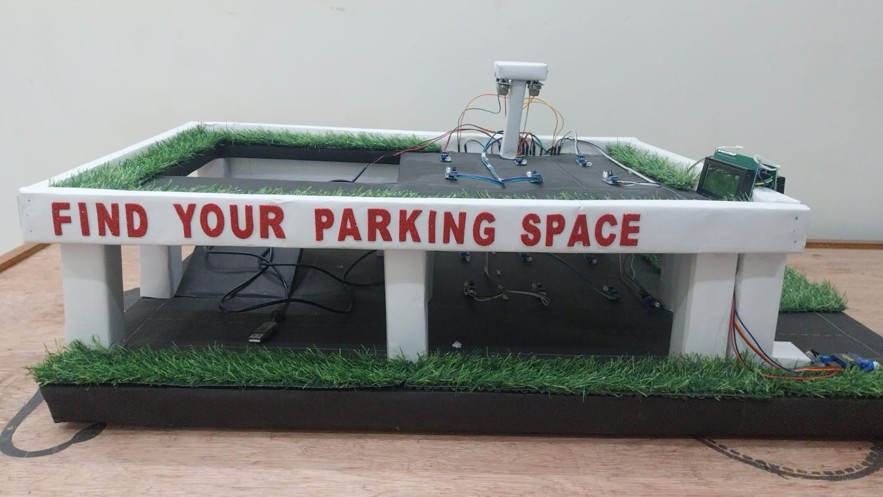
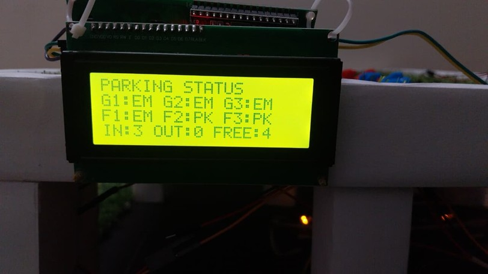
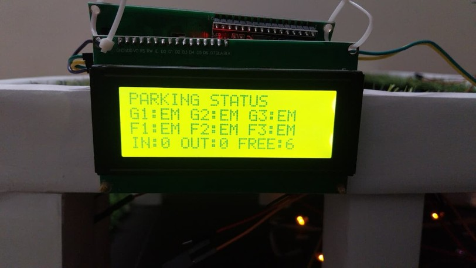

# 🚗 Find Your Parking Space System 🅿️

> 📡 A Smart Embedded System for Detecting and Displaying Available Parking Slots Using Sensors and Arduino.

---

# 📖 Overview

The **Find Your Parking Space System** is an Arduino-based smart parking management project designed to help users easily identify available parking slots in parking areas.

The system continuously monitors parking spaces using sensors and displays whether slots are occupied or available. This helps reduce traffic congestion, saves time, and improves parking management efficiency.

✨ The project uses:
- ⚡ Arduino UNO
- 📡 Sensors
- 🔄 Servo Motor
- 📟 LCD Displays
- 🔔 Buzzer

🎯 The main objective of this project is to provide a low-cost and efficient smart parking solution.

---

# 🎯 Objectives

✅ Detect available parking spaces  
✅ Reduce parking search time  
✅ Display parking slot status  
✅ Improve parking management  
✅ Provide an automated parking guidance system  

---

# ✨ Features

🚗 Real-time parking slot detection  
📟 Parking slot display system  
🔄 Automatic gate control using servo motor  
🔔 Alert indication system  
⚡ Low power consumption  
💰 Cost-effective implementation  
🛠️ Easy installation and maintenance  

---

# ⚙️ Working Principle

📡 Sensors are placed at parking slots to detect vehicle presence.

🚗 When a vehicle occupies a parking slot:
- Slot status changes to occupied
- Parking availability gets updated on the display

✅ When the slot is empty:
- Slot status changes to available

📟 LCD displays show:
- Available parking slots
- Occupied parking slots
- Parking floor information

🔄 Servo motor is used for:
- Automatic gate opening
- Automatic gate closing

🔔 Buzzer provides alert indications during parking operations.

---

# 🧱 Block Diagram

## 📥 Input Section
- 📡 MQ7 Gas Sensor
- 🌫️ MQ135 Air Quality Sensor
- 🚗 Parking Sensors

## 🧠 Processing Section
- ⚡ Arduino UNO

## 📤 Output Section
- 📟 LCD Displays
- 🔄 Servo Motor
- 🔔 Buzzer

---

# 🛠️ Hardware Used

## ⚡ Arduino UNO
Main controller used to process sensor data and control outputs.

---

## 📡 Sensors
Used for detecting vehicle presence in parking slots.

---

## 🔄 Servo Motor
Used for automatic gate opening and closing.

---

## 📟 LCD Displays
Displays parking slot information and availability status.

---

## 🔔 Buzzer
Used for alert indications.

---

# 💻 Software Used

## 🖥️ Arduino IDE

The project is programmed using **Arduino IDE**.

### ✨ Features:
- 📝 Writing and uploading code
- 🔌 Compatible with Arduino boards
- 🌐 Offline development support
- 📡 Serial monitoring support

## 🔗 Download Arduino IDE
https://www.arduino.cc/en/software

---

# 📂 Source Code

The source code for the project is included in the `src/` folder.

### 🔧 Main Functionalities
- 📡 Parking slot sensing
- 🚗 Vehicle detection
- 📟 LCD interfacing
- 🔄 Servo motor control
- 🔔 Alert system

---

# 📸 Project Images

## 🏗️ Complete Project Setup


## 🌫️ Air Quality Display


## 🚗 Vehicle Parked Detection


## 🅿️ Empty Slot Detection


## 🏢 Parking Slots First Floor


---

# 📸 Results

✅ Detects vehicle presence  
✅ Displays available parking spaces  
✅ Controls gate automatically using servo motor  
✅ Reduces parking search time  
✅ Provides efficient parking management  

---

# 🌍 Applications

🏢 Shopping malls  
🏫 Colleges and universities  
🏥 Hospitals  
🏬 Commercial buildings  
🛬 Airports  
🏙️ Smart city parking systems  

---

# 🚀 Future Improvements

📶 Wi-Fi module integration  
📱 Mobile application support  
☁️ IoT-based monitoring  
📷 Camera integration  
🛰️ Cloud data storage  
🤖 AI-based vehicle analytics  

---

# 💰 Cost Analysis

| 🧩 Component | 💵 Cost |
|---|---|
| ⚡ Arduino UNO | ₹800 |
| 📡 Sensors | ₹500 |
| 🔄 Servo Motor | ₹150 |
| 📟 LCD Displays (2) | ₹600 |
| 🔔 Buzzer | ₹20 |
| 🔌 Breadboard | ₹80 |
| 🛠️ Other Materials (Cardboard, Charts, Thermocol, Gum, etc.) | ₹1800 Approx. |

# 💸 Total Cost: ₹4000 Approx.

---

# 📁 Folder Structure

```text
find-your-parking-space/
│
├── README.md
│
├── src/
│   └── code.ino
│
├── images/
│   ├── AirQuality.jpg
│   ├── Empty.jpg
│   ├── Parked.jpg
│   ├── Parking slots 1st floor.jpg
│   └── Project.jpg
│
├── docs/
│   └── Find Your Parking Space.pptx
